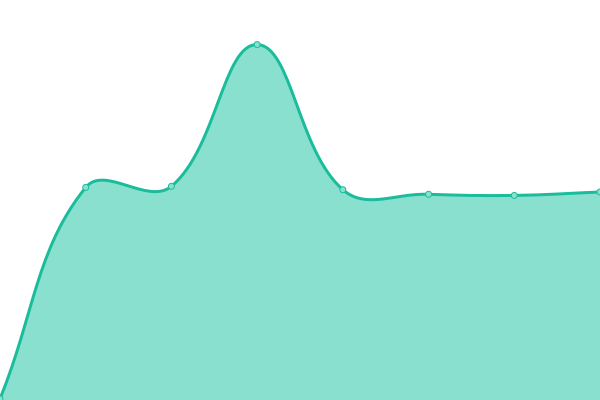

# 🚥 statut.annuaire-entreprises.data.gouv.fr

Bienvenue sur le tableau de bord des disponibilités des API utilisées dans [l’Annuaire des Entreprises](https://annuaire-entreprises.data.gouv.fr)

## 🏗 Comment ca marche ?

Ce projet est un fork du projet opensource upptime (https://upptime.js.org). Il fonctionne entièrement avec des GitHub Actions et des Issues. Il est développé par l'excellente équipe de [Koj](https://koj.co).

## 🦦 Ou on en est ?

<!--start: status pages-->
<!-- This summary is generated by Upptime (https://github.com/upptime/upptime) -->
<!-- Do not edit this manually, your changes will be overwritten -->
<!-- prettier-ignore -->
| URL | Status | History | Response Time | Uptime |
| --- | ------ | ------- | ------------- | ------ |
|  [Site Annuaire des Entreprises](https://annuaire-entreprises.data.gouv.fr/entreprise/880878145) | Opérationnel | [site-annuaire-des-entreprises.yml](https://github.com/etalab/statut.annuaire-entreprises.data.gouv.fr/commits/HEAD/history/site-annuaire-des-entreprises.yml) | 

 908ms
     
 | 

<a href="https://etalab.github.io/statut.annuaire-entreprises.data.gouv.fr/history/site-annuaire-des-entreprises">100.00%</a>
    

|  [Site INPI](https://data.inpi.fr/entreprises/880878145) | Opérationnel | [site-inpi.yml](https://github.com/etalab/statut.annuaire-entreprises.data.gouv.fr/commits/HEAD/history/site-inpi.yml) | 

 3052ms
     
 | 

<a href="https://etalab.github.io/statut.annuaire-entreprises.data.gouv.fr/history/site-inpi">100.00%</a>
    

|  [API RNM](https://annuaire-entreprises.data.gouv.fr/api/ping/api-rnm) | Opérationnel | [api-rnm.yml](https://github.com/etalab/statut.annuaire-entreprises.data.gouv.fr/commits/HEAD/history/api-rnm.yml) | 

 1056ms
     
 | 

<a href="https://etalab.github.io/statut.annuaire-entreprises.data.gouv.fr/history/api-rnm">100.00%</a>
    

|  [API RNCS](https://annuaire-entreprises.data.gouv.fr/api/ping/api-rncs) | Opérationnel | [api-rncs.yml](https://github.com/etalab/statut.annuaire-entreprises.data.gouv.fr/commits/HEAD/history/api-rncs.yml) | 

 274ms
     
 | 

<a href="https://etalab.github.io/statut.annuaire-entreprises.data.gouv.fr/history/api-rncs">100.00%</a>
    

|  [API SIRENE INSEE](https://annuaire-entreprises.data.gouv.fr/api/ping/api-sirene-insee) | Indisponible | [api-sirene-insee.yml](https://github.com/etalab/statut.annuaire-entreprises.data.gouv.fr/commits/HEAD/history/api-sirene-insee.yml) | 

 315ms
     
 | 

<a href="https://etalab.github.io/statut.annuaire-entreprises.data.gouv.fr/history/api-sirene-insee">100.00%</a>
    

|  [API SIRENE DONNEES OUVERTES](https://annuaire-entreprises.data.gouv.fr/api/ping/api-sirene-donnees-ouvertes) | Opérationnel | [api-sirene-donnees-ouvertes.yml](https://github.com/etalab/statut.annuaire-entreprises.data.gouv.fr/commits/HEAD/history/api-sirene-donnees-ouvertes.yml) | 

 124ms
     
 | 

<a href="https://etalab.github.io/statut.annuaire-entreprises.data.gouv.fr/history/api-sirene-donnees-ouvertes">100.00%</a>
    

|  [API Conventions Collectives](https://annuaire-entreprises.data.gouv.fr/api/ping/api-conventions-collectives) | Opérationnel | [api-conventions-collectives.yml](https://github.com/etalab/statut.annuaire-entreprises.data.gouv.fr/commits/HEAD/history/api-conventions-collectives.yml) | 

 220ms
     
 | 

<a href="https://etalab.github.io/statut.annuaire-entreprises.data.gouv.fr/history/api-conventions-collectives">100.00%</a>
    

|  [Test erreur](https://annuaire-entreprises.data.gouv.fr/404) | Indisponible | [test-erreur.yml](https://github.com/etalab/statut.annuaire-entreprises.data.gouv.fr/commits/HEAD/history/test-erreur.yml) | 

 203ms
     
 | 

<a href="https://etalab.github.io/statut.annuaire-entreprises.data.gouv.fr/history/test-erreur">100.00%</a>
    

|  [Test erreur 500](https://annuaire-entreprises.data.gouv.fr/500) | Indisponible | [test-erreur-500.yml](https://github.com/etalab/statut.annuaire-entreprises.data.gouv.fr/commits/HEAD/history/test-erreur-500.yml) | 

 103ms
     
 | 

<a href="https://etalab.github.io/statut.annuaire-entreprises.data.gouv.fr/history/test-erreur-500">100.00%</a>
    

<!--end: status pages-->

## 📄 License

- Powered by: [Upptime](https://github.com/upptime/upptime)
- Code: [MIT](./LICENSE) © [beta.gouv.fr](https://beta.gouv.fr)
- Data in the `./history` directory: [Open Database License](https://opendatacommons.org/licenses/odbl/1-0/)
